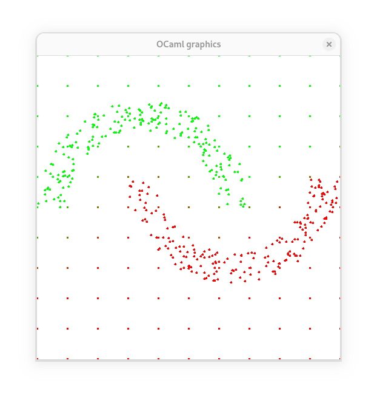

# Two moons classification

The goal is to classify two sets of points looking like imbricated half moons. We quickly reach our goal by training a neural network with 3 layers and relu activations:

(the regularly spaced points are the output of the neural network).

This is largely inspired from [this example](https://github.com/karpathy/micrograd/blob/master/demo.ipynb) of [micrograd](https://github.com/karpathy/micrograd).
